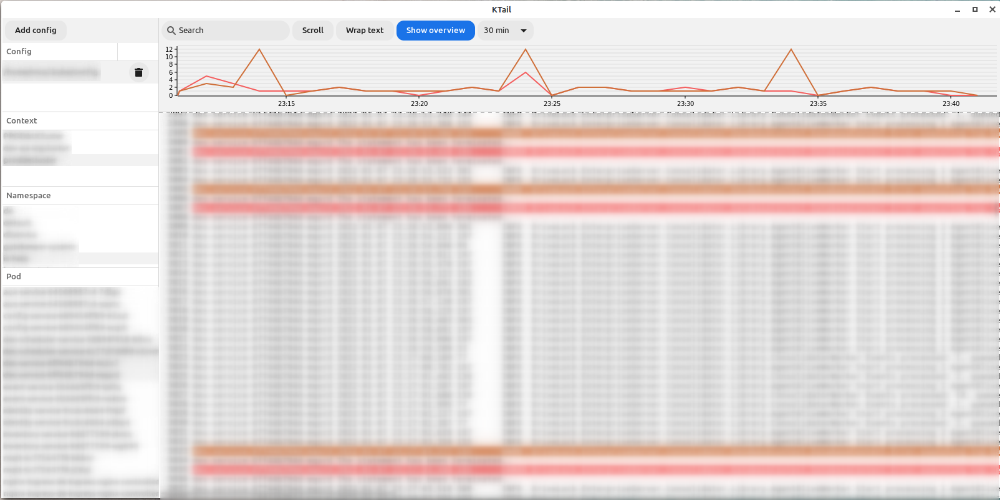

# Kubernetes log viewer

KTail allows you to tail multiple pods in one view. It automatically detects updates and attaches to new pods. Configurable highlighters show how often regular expressions matched and let you quickly navigate in the results.

- Multiple kubernetes configurations can be added
- Select a single pod via double click or multiple pods via Shift / Ctrl + Enter 
- Highlighters can be configured in the config.json

For build instructions please check the linux-build.yml workflow. Windows and MacOS will be added later.

You can find more information on our official website: https://ktail.de
